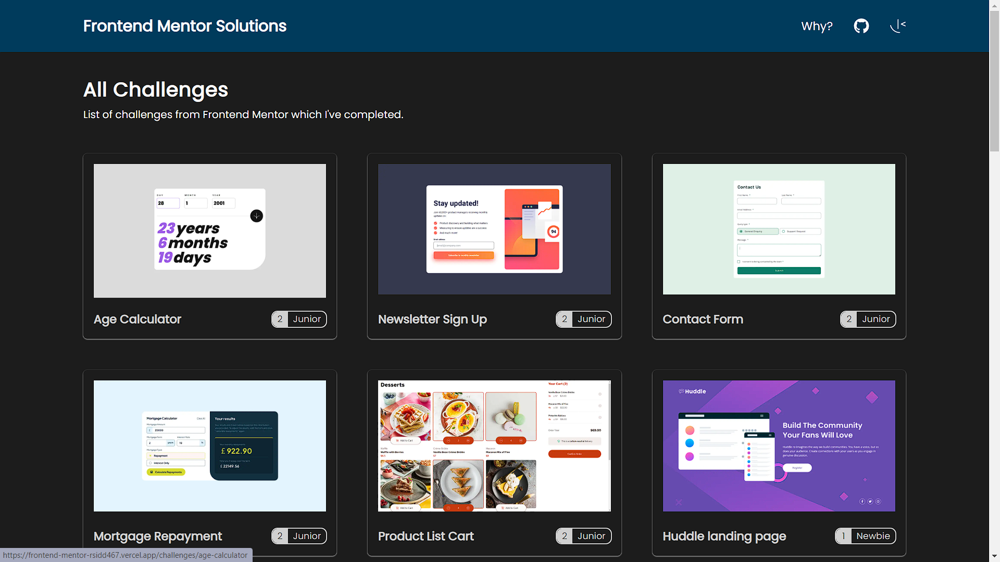

<p align="center">
</p>

---

<p align="center"> Frontend Mentor Challanges
    <br> 
</p>

## 📝 Table of Contents

- [About](#about)
- [ScreenShot](#ss)
- [Challenges](#challenges)
- [Deployment](#deployment)
- [Built Using](#built_using)
- [Authors](#authors)

## 🧐 About <a name = "about"></a>

A Frontend Mentor challanges page where all of my challanges will be showcased. From this my github profile will be less populated by small repositories.

- Live : https://portfolio-rsidd467.vercel.app

## 📷 Screenshot <a name = "ss"></a>



## 📷 Challenges <a name = "challenges"></a>

- [Qr-code]()
- [Blog preview card]()
- [Social links]()
- [Recipe page]()
- [Product card]()
- [Card feature]()
- [Testimonials grid]()
- [Result summary component]()

## 🚀 Deployment <a name = "deployment"></a>

This project is deployed using [Vercel](https://vercel.com).

## ⛏️ Built Using <a name = "built_using"></a>

- [NextJs](https://nextjs.org/) - React Framework
- [Tailwind](https://tailwindcss.com/) - CSS Framework
- [Javascript](https://www.typescriptlang.org/) - Programming language
- [React](https://react.dev/) - Web library
- [NodeJs](https://nodejs.org/en/) - Server Environment

## ✍️ Authors <a name = "authors"></a>

- [@sidr467](https://github.com/sidr467) - Idea & Initial work

<!-- # frontend_mentor

A Frontend Mentor challanges page where all of my challanges of will be showcased. From this my github profile will be less populated by small repositories.

This is a [Next.js](https://nextjs.org/) project bootstrapped with [`create-next-app`](https://github.com/vercel/next.js/tree/canary/packages/create-next-app).

## Getting Started

First, run the development server:

```bash
npm run dev
# or
yarn dev
# or
pnpm dev
# or
bun dev
```

Open [http://localhost:3000](http://localhost:3000) with your browser to see the result.

You can start editing the page by modifying `app/page.js`. The page auto-updates as you edit the file.

This project uses [`next/font`](https://nextjs.org/docs/basic-features/font-optimization) to automatically optimize and load Inter, a custom Google Font.

## Learn More

To learn more about Next.js, take a look at the following resources:

- [Next.js Documentation](https://nextjs.org/docs) - learn about Next.js features and API.
- [Learn Next.js](https://nextjs.org/learn) - an interactive Next.js tutorial.

You can check out [the Next.js GitHub repository](https://github.com/vercel/next.js/) - your feedback and contributions are welcome!

## Deploy on Vercel

The easiest way to deploy your Next.js app is to use the [Vercel Platform](https://vercel.com/new?utm_medium=default-template&filter=next.js&utm_source=create-next-app&utm_campaign=create-next-app-readme) from the creators of Next.js.

Check out our [Next.js deployment documentation](https://nextjs.org/docs/deployment) for more details. -->
